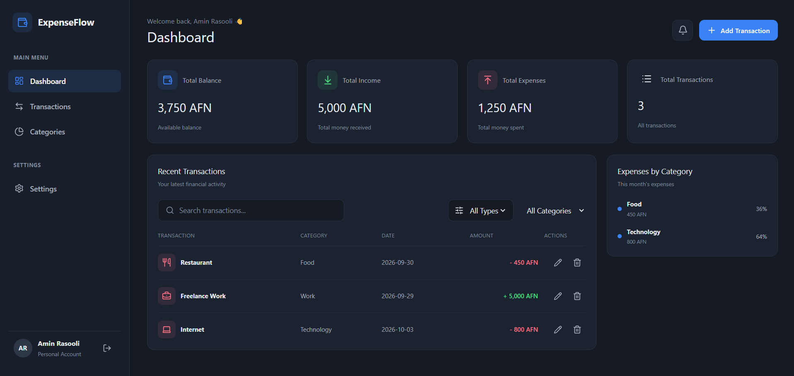

# ExpenseFlow — Personal Finance Tracker



**ExpenseFlow** is a modern and responsive personal finance application built with React and Supabase. It helps users manage their income and expenses, organize transactions, monitor their financial balance, and keep their financial records organized through a clean and intuitive dashboard.

## ✨ Features

### 🔐 Authentication
- User registration with email and password
- User login and logout
- Email confirmation through Supabase Auth
- Individual user accounts
- Session management

### 💰 Transaction Management
- Add new income and expense transactions
- Edit existing transactions
- Delete transactions with confirmation
- Organize transactions by category
- Track transaction dates and amounts
- Automatically calculate income, expenses, and balance

### 🔎 Search & Filtering
- Search transactions by title
- Filter by transaction type
- Filter by category
- Combine search and filtering options

### 📊 Financial Dashboard
- Total income overview
- Total expenses overview
- Current balance
- Transaction summary
- Recent transactions
- Expense category breakdown

### ⚙️ Settings & Notifications
- Customize the display name
- Select a preferred currency
- Switch between light and dark themes
- Receive transaction notifications
- View notification history

### 📱 User Experience
- Responsive interface
- Mobile-friendly layout
- Interactive components
- Confirmation modals
- Empty states
- Lucide icons
- Smooth interface interactions

### ☁️ Database & Security
- Supabase authentication
- PostgreSQL database integration
- Cloud-based transaction storage
- Row Level Security (RLS) policies
- User-specific transaction access
- Transaction data persists after refreshing the page

## 🛠️ Tech Stack

| Technology | Purpose |
|---|---|
| React | User interface |
| JavaScript | Application logic |
| Vite | Development server and build tool |
| CSS | Styling and responsive layouts |
| Supabase Auth | Authentication and user sessions |
| Supabase PostgreSQL | Transaction database |
| Supabase RLS | Database access control |
| Lucide React | Icons |

## 📁 Project Structure

```text
expense-tracker-js/
├── public/
├── src/
│   ├── components/
│   │   ├── CategoryItem.jsx
│   │   ├── DeleteModal.jsx
│   │   ├── ExpenseCategories.jsx
│   │   ├── Login.jsx
│   │   ├── Notification.jsx
│   │   ├── NotificationPanel.jsx
│   │   ├── QuickAdd.jsx
│   │   ├── RecentTransactions.jsx
│   │   ├── Settings.jsx
│   │   ├── Sidebar.jsx
│   │   ├── SummaryCard.jsx
│   │   ├── SummaryCards.jsx
│   │   ├── Topbar.jsx
│   │   ├── TransactionModal.jsx
│   │   ├── TransactionRow.jsx
│   │   └── TransactionToolbar.jsx
│   ├── lib/
│   │   └── supabase.js
│   ├── App.jsx
│   ├── global.css
│   └── main.jsx
├── .gitignore
├── index.html
├── package.json
├── package-lock.json
└── vite.config.js
```

## 🚀 Getting Started

### Prerequisites

- Node.js and npm
- A Supabase account

### 1. Clone the Repository

```bash
git clone https://github.com/aminrasooli2007-svg/expense-tracker-js.git
```

### 2. Navigate to the Project

```bash
cd expense-tracker-js
```

### 3. Install Dependencies

```bash
npm install
```

### 4. Configure Supabase

Create a `.env.local` file in the project root directory and add your Supabase project credentials:

```env
VITE_SUPABASE_URL=https://YOUR_PROJECT_REF.supabase.co
VITE_SUPABASE_PUBLISHABLE_KEY=YOUR_SUPABASE_PUBLISHABLE_KEY
```

Replace the placeholder values with the URL and publishable key from your Supabase project.

Ensure that the `transactions` table and its Row Level Security policies are configured in Supabase.

**Security note:** Never expose a Supabase secret key in frontend code or commit private environment files to GitHub. Keep `.env.local` out of version control.

### 5. Start the Development Server

```bash
npm run dev
```

Open the local URL displayed by Vite in your browser.

## 🗄️ Database

ExpenseFlow uses a PostgreSQL database managed by Supabase.

The `transactions` table stores information such as:

- Transaction ID
- User ID
- Title
- Amount
- Type
- Category
- Date
- Creation timestamp

Row Level Security policies restrict authenticated users to their own transaction records. Users can manage their transactions without accessing another user's records through the normal application flow.

## 📌 Project Status

**Status: Actively Developed**

The core interface, authentication, and transaction management features have been implemented and tested. Further improvements are planned as the project evolves.

## 🎯 Future Improvements

- Financial charts and visual analytics
- Export transactions to CSV
- Recurring transactions
- Advanced financial reports
- Improved account profile management
- Cloud synchronization for additional user preferences
- Additional accessibility and usability improvements

## 👨‍💻 Author

**Amin Rasooli**

Frontend Developer | Software Engineering Student

- GitHub: [aminrasooli2007-svg](https://github.com/aminrasooli2007-svg)

## 📄 Purpose

ExpenseFlow is a personal project created for learning, portfolio development, and practical experience with React, Supabase, database integration, and authentication.
